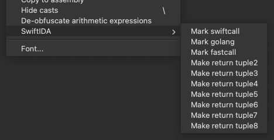

# SwiftIDA

This is a simple plugin for IDA to aid with reverse engineering languages that have multiple return values and non-standard calling conventions. While IDA does not automatically detect such patterns, it allows you to implement them yourself using the `__usercall` calling convention. This plugin defines a set of shortcuts to easily change a function's signature and match Swift's calling convention. With minor changes, it should also work with Go, Rust, etc.

## Supported architectures

- arm64
- x86_64

## Usage

Download `swift-ida.py` and drop it in your IDA's `plugins` folder. After that, simply right-click on a function definition and you will see the `SwiftIDA` menu.

---

#### Before:

---

#### After:

## References

- https://github.com/swiftlang/swift/blob/main/docs/ABI/CallConvSummary.rst
- https://hex-rays.com/blog/igors-tip-of-the-week-107-multiple-return-values
- https://hex-rays.com/blog/igors-tip-of-the-week-51-custom-calling-conventions
